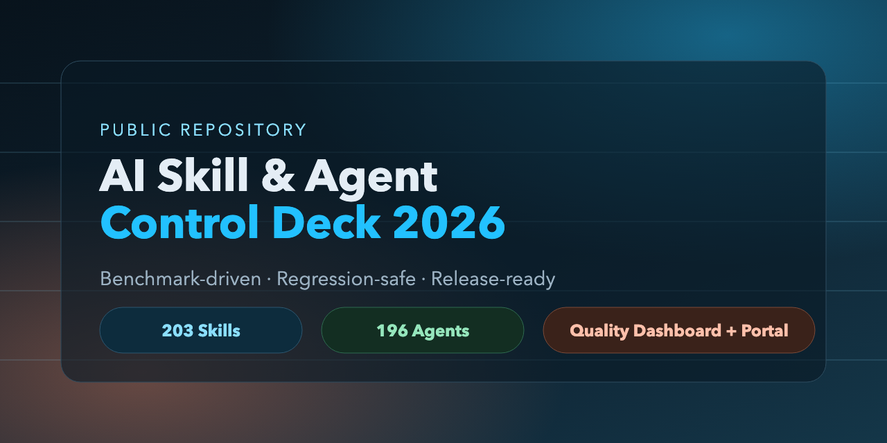
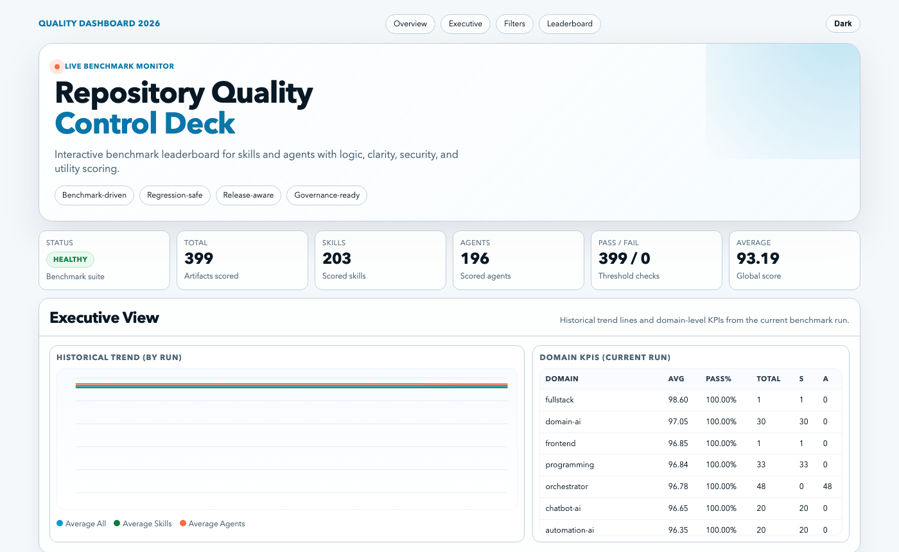
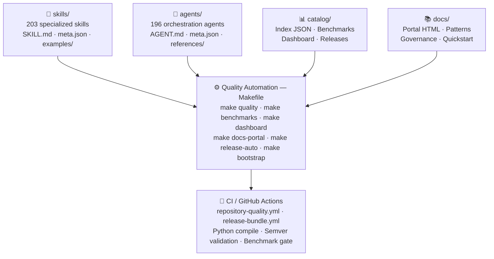
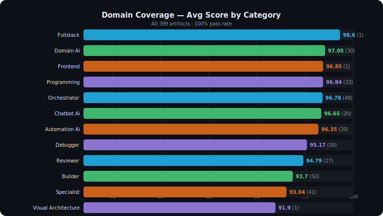
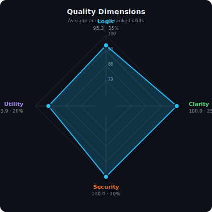
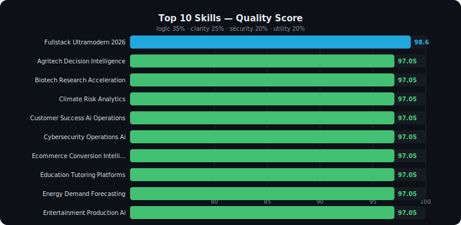

<div align="center">

# AI Skill & Agent Control Deck 2026

**Drop 203 benchmarked skills and 196 agents directly into Claude Code.**



<br/>

[](CHANGELOG.md)
[](LICENSE)
[](.github/workflows/repository-quality.yml)
[](skills/)
[](agents/)
[](catalog/benchmark-results.json)
[](catalog/benchmark-results.json)

<br/>

```
╔══════════════════════════════════════════════════════════════════╗
║    Build · Measure · Scale · Govern · Release                    ║
║    203 Skills  ·  196 Agents  ·  30 Logic Foundations           ║
║    Benchmark-driven  ·  Regression-safe  ·  Release-ready       ║
╚══════════════════════════════════════════════════════════════════╝
```

[Quick Start](#install-in-3-commands) · [Documentation](#documentation) · [Skills](skills/) · [Agents](agents/) · [Dashboard](catalog/quality-dashboard.html) · [Contributing](CONTRIBUTING.md)

</div>

---

## Install in 3 commands

```bash
git clone https://github.com/JonatanGS777/ai-skill-agent-control-deck-2026.git
cd ai-skill-agent-control-deck-2026
make bootstrap
```

> **Requires:** [Claude Code CLI](https://claude.ai/code) + Python 3.9+

---

## What is this?

This repository is a production platform for creating and managing **skills** (reusable capabilities) and **agents** (skill orchestrators) for Claude Code and Codex, featuring:

- **Explicit logical foundation** — every skill/agent declares its formal and mathematical dependencies
- **Measurable quality** — scored by `logic`, `clarity`, `security`, and `utility` for each component
- **Automated governance** — CI blocks PRs that fail benchmarks and regression checks
- **Domain coverage** — from propositional logic to applied AI across 20+ industries

---

## Repository Stats

<div align="center">



| Component | Count | Status |
|:---:|:---:|:---:|
| Specialized skills | **203** | ✅ Healthy |
| Orchestration agents | **196** | ✅ Healthy |
| Logic foundation skills | **30** | ✅ 100% covered |
| Benchmark pass rate | **100%** | ✅ Passing |
| Current version | **v1.0.0** | ✅ Stable |

</div>

---

## System Architecture



---

## Domain Coverage

<div align="center">



</div>

<div align="center">

| Category | Included Skills |
|---|---|
| **Logic & Mathematics** | Propositional reasoning, predicate quantifiers, proof strategies, Hoare logic, set theory, discrete structures, complexity analysis |
| **Applied AI** | Customer success, agritech, biotech, climate analytics, cybersecurity, ecommerce, education, energy, healthcare, legal, finance, logistics |
| **Software Engineering** | Full-stack, automation, workflow orchestration, security, testing, debugging, frontend frameworks |
| **Agent Types** | Auditor, Builder, Strategist, Reviewer |

</div>

### Agent Archetypes

Each industry domain includes 3 ready-to-use agent roles:

<div align="center">

| Archetype | Purpose |
|:---:|---|
| **Strategist** | High-level planning, decision intelligence, opportunity analysis |
| **Builder** | Implementation pipelines, automation, system construction |
| **Auditor** | Quality control, compliance, risk analysis, governance |

</div>

---

## Available Make Commands

```bash
make bootstrap      # Full repository initialization
make quality        # Full gate: compile + semver + benchmarks + catalog + dashboard
make benchmarks     # Run benchmark suite (scored across 4 dimensions)
make dashboard      # Generate interactive HTML quality dashboard
make docs-portal    # Generate HTML documentation portal
make catalog        # Rebuild skills/agents index
make release-auto   # Create automatic patch release
make logic-pack     # Install the 30 logic foundation skills
```

---

## Project Structure

```
ai-skill-agent-control-deck-2026/
│
├── skills/                    # 203 specialized skills
│   └── [skill-name]/
│       ├── SKILL.md           # Main definition (frontmatter + workflow + guardrails)
│       ├── README.md          # Installation and usage
│       ├── skill.meta.json    # Metadata and version
│       ├── examples/          # Example prompts
│       └── references/        # Quality gates and criteria
│
├── agents/                    # 196 orchestration agents
│   └── [agent-name]/
│       ├── AGENT.md           # Skill profile + logical core
│       ├── agent.meta.json    # Metadata
│       └── references/        # Agent skill index
│
├── catalog/                   # Quality indexes and benchmarks
│   ├── skills.index.json      # Searchable skill index
│   ├── agents.index.json      # Searchable agent index
│   ├── benchmark-results.json # Current scores (logic/clarity/security/utility)
│   ├── quality-dashboard.html # Interactive dashboard
│   └── releases/v1.0.0/       # Release notes
│
├── scripts/                   # 13 Python automation scripts
├── docs/                      # Documentation and governance
│   ├── patterns.md
│   ├── anti-patterns.md
│   ├── quickstart.md
│   ├── governance/
│   └── claude-code-guide.md   # Complete Claude Code guide
│
├── .github/workflows/         # CI/CD
├── Makefile                   # Build and quality automation
└── CONTRIBUTING.md            # Contribution workflow
```

---

## 4-Dimension Quality System

Every skill and agent is scored across:

<div align="center">


&nbsp;&nbsp;&nbsp;


</div>

| Dimension | Weight | Description |
|---|:---:|---|
| `logic` | 35% | Formal soundness: correctness, invariants, verifiable steps |
| `clarity` | 25% | Documentation, examples, understandable instructions |
| `security` | 20% | Threat handling, guardrails, boundary validation |
| `utility` | 20% | Practical value, real-world case coverage |

**Top current score:** `fullstack-ultramodern-2026` — **98.6 / 100**

---

## Documentation

| Resource | Description |
|---|---|
| [Claude Code Guide](docs/claude-code-guide.md) | Complete bilingual (ES/EN) reference — 18 sections, tools, memory, hooks, MCP, agents |
| [Quick Start](docs/quickstart.md) | Setup in 5 minutes |
| [Recommended Patterns](docs/patterns.md) | 5 proven patterns (Skill, Agent, Quality, Release) |
| [Anti-patterns](docs/anti-patterns.md) | 5 common mistakes and how to fix them |
| [Definition of Done](docs/governance/definition-of-done.md) | Acceptance checklist for contributions |
| [Review Checklist](docs/governance/review-checklist.md) | PR review checklist |
| [Docs Portal](docs/portal/index.html) | Auto-generated HTML portal |
| [Quality Dashboard](catalog/quality-dashboard.html) | Interactive score visualization |

---

## Contribution Workflow

```bash
# 1. Fork and clone
git clone https://github.com/[your-username]/ai-skill-agent-control-deck-2026.git

# 2. Create a feature branch
git checkout -b feat/new-skill-domain

# 3. Create skill using the universal script
python scripts/universal_skill_creator.py

# 4. Run quality gate locally
make quality

# 5. Open a Pull Request
# CI will automatically run: compile + semver + benchmarks
```

See [CONTRIBUTING.md](CONTRIBUTING.md) for the full workflow and contribution standards.

---

## Releases

| Version | Date | Channel | Status |
|---|---|---|---|
| [v1.0.0](catalog/releases/v1.0.0/release-notes.md) | 2026-04-05 | stable | ✅ Healthy |

---

## License

MIT © 2026 Yonatan Guerrero Soriano — see [LICENSE](LICENSE)

---

<div align="center">

**Built with logical rigor, measured with benchmarks, released with confidence.**

[Back to top](#ai-skill--agent-control-deck-2026)

</div>
